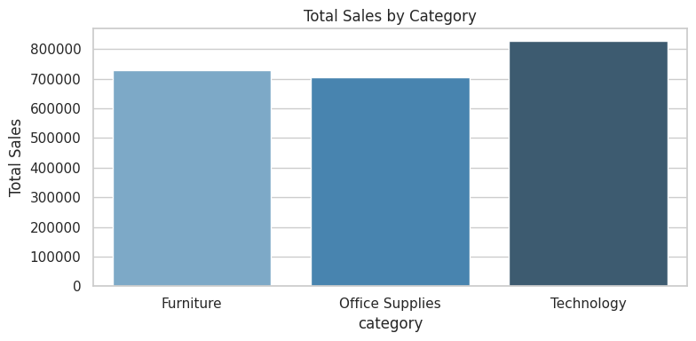
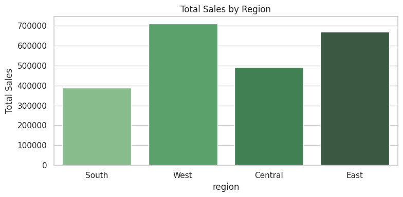
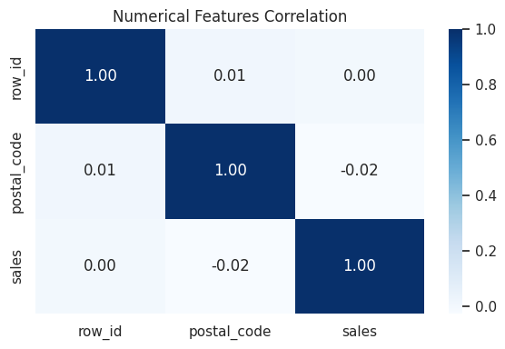

# SWYNEX Task 2: Exploratory Data Analysis (EDA)

## Project Overview
This repository contains the Exploratory Data Analysis (EDA) performed on the Superstore Sales Dataset for Task 2 of the SWYNEX Technologies Internship.

## Visualizations

## Key Insights
1. **Category Performance:** Technology leads in total sales performance, followed closely by Furniture and Office Supplies.
2. **Regional Sales Distribution:** The West region generates the highest revenue, with East coming in second.
3. **Correlation Analysis:** Explored numerical relationships across sales and customer data.
4. **Data Integrity:** Dataset processed and verified cleanly without missing values.

## Technologies Used
- Python (Pandas, Matplotlib, Seaborn)
- Google Colab / Jupyter Notebook
- Git & GitHub
